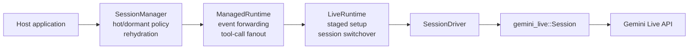
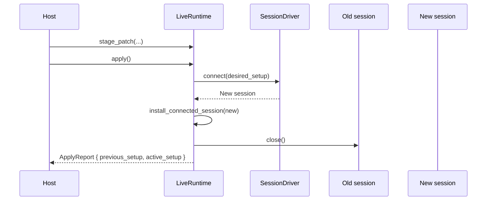
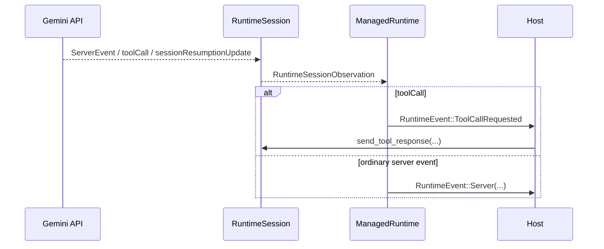
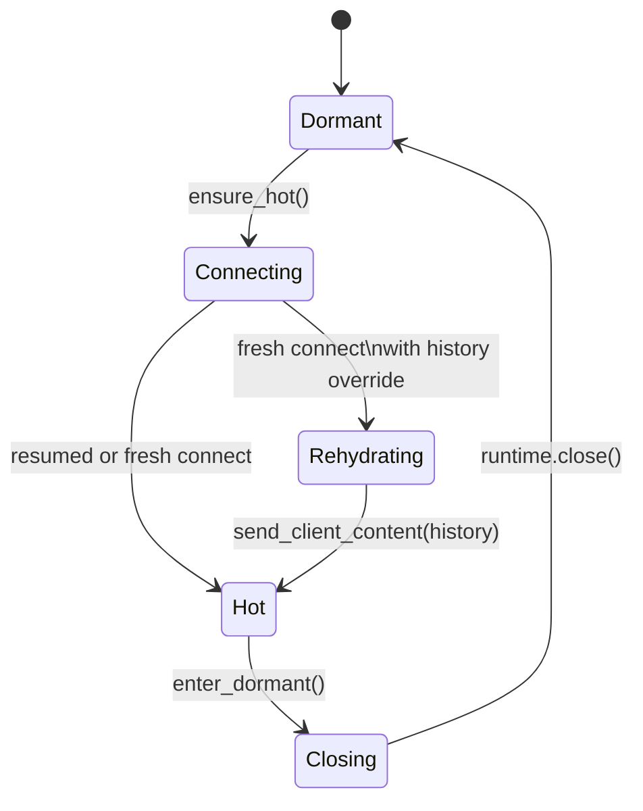

# gemini-live-runtime

Reusable host-side runtime orchestration layered above `gemini_live::Session`.

`gemini-live` already owns the wire protocol, reconnect logic, and low-level
session semantics. This crate adds the host-side control plane that most
applications need but should not keep re-implementing:

- staged versus active `setup`
- a testable `SessionDriver` boundary
- managed event forwarding into one runtime stream
- tool-call request and cancellation fanout
- process-local conversation memory
- hot versus dormant session lifecycle management

## What This Crate Adds



Choose the lowest layer that matches the host you are building:

| Type | Owns | Use it when |
| --- | --- | --- |
| `LiveRuntime` | `desired_setup`, `active_setup`, connect/apply/close | You already own your own async event loop and tool execution, and only need staged setup plus exact session switchover. |
| `ManagedRuntime` | `LiveRuntime` plus session forwarding, tool-call request fanout, resume-handle tracking, runtime events | You want one host-facing event stream and do not want to duplicate session forwarding or resume-handle tracking. |
| `SessionManager` | `ManagedRuntime` plus idle policy, process-local memory, dormant/hot transitions, fresh-session rehydration | Your product keeps a process alive longer than one hot Live session and needs to wake, sleep, and restore context. |

## Lifecycle

The lifecycle is intentionally split into three layers. The crate does not hide
all behavior behind one opaque state machine because the policy boundaries are
different:

- `LiveRuntime` owns setup staging and session replacement.
- `ManagedRuntime` owns async forwarding around one active session.
- `SessionManager` owns host policy for dormancy, wake-up, and rehydration.

### `LiveRuntime`: staged setup and exact session switchover

`LiveRuntime` keeps two copies of setup:

- `desired_setup`: staged edits for the next connect/apply
- `active_setup`: the setup currently installed on the live session

Applying a patch does not mutate the live session in place. It connects the
next session first, installs it, then closes the old one.



This layer intentionally does not own:

- tool execution
- event fan-out
- resume-handle persistence
- dormant/hot policy

### `ManagedRuntime`: one active session plus tool-call fanout

`ManagedRuntime` wraps `LiveRuntime` and owns the async machinery that hosts
would otherwise duplicate:

- one forwarder task for the active session
- interception of `toolCall` and `toolCallCancellation`
- conversion into host-facing tool request events
- conversion into `RuntimeEvent`
- tracking the latest `sessionResumptionUpdate` handle
- generation-based filtering so late non-lifecycle events from a superseded
  session are dropped



Switchover is explicit here too:

- `apply()` requires a runtime-issued resume handle and reconnects with
  `session_resumption.handle` injected into a one-off setup clone.
- `apply_fresh()` is the explicit fresh-session path.
- `active_setup` and `desired_setup` remain handle-free; the handle is not
  promoted into steady-state config.
- lifecycle events are explicit:
  - `connect()`: `Connecting` -> `Connected`
  - `apply()`: `Reconnecting` -> `AppliedResumedSession`
  - `apply_fresh()`: `Reconnecting` -> `AppliedFreshSession`
  - `close()`: `Closed`

This crate does not silently downgrade `apply()` into a fresh reconnect. If
there is no valid handle yet, `apply()` returns
`RuntimeError::MissingResumeHandle`.

### `SessionManager`: dormancy, wake-up, and rehydration

`SessionManager` is the layer above `ManagedRuntime` for products that want a
process to outlive any one hot Live session.

It adds:

- `IdlePolicy`
- process-local `ConversationMemoryStore`
- `SessionLifecycleState`
- wake strategies: `AlreadyHot`, `Resume`, `Fresh`, `FreshWithRehydrate`



`ManagedRuntime::apply()` and `apply_fresh()` do not create a separate
`SessionManager` state. They are reconnect operations that happen while the
host still considers the session logically hot.

Wake behavior follows first principles instead of hidden fallback:

1. If a hot session already exists, keep using it.
2. If a recent resumable handle exists, try `connect_resumed(handle)`.
3. If resumption is unavailable or fails, decide explicitly between:
   - `Fresh`: connect a new session with the desired setup
   - `FreshWithRehydrate`: connect a fresh session with
     `history_config.initial_history_in_client_content = true`, then replay the
     rolling summary and recent turns from process-local memory

That separation matters because "resume the same conversation" and "boot a new
session, then seed it with remembered context" are different operations with
different failure modes.

## Design Rules

- `ManagedRuntime::apply()` is resume-only; fresh reconnect is
  `ManagedRuntime::apply_fresh()`.
- `SessionManager` is the only layer that may fall back from resume to fresh
  plus rehydrate, because that decision is host policy rather than setup
  orchestration.
- Resume handles are short-lived runtime state, not part of the steady-state
  desired config.
- Fresh-session rehydration uses process-local memory only; this crate does not
  claim durable cross-process persistence.

## Minimal Example

```rust
use gemini_live::ReconnectPolicy;
use gemini_live::session::SessionConfig;
use gemini_live::transport::{Auth, TransportConfig};
use gemini_live::types::{Content, Part, SetupConfig};
use gemini_live_runtime::{
    GeminiSessionDriver, ManagedRuntime, Patch, RuntimeConfig, RuntimeEvent, SetupPatch,
};

#[tokio::main]
async fn main() -> Result<(), Box<dyn std::error::Error>> {
    let config = RuntimeConfig {
        session: SessionConfig {
            transport: TransportConfig {
                auth: Auth::ApiKey(std::env::var("GEMINI_API_KEY")?),
                ..Default::default()
            },
            setup: SetupConfig {
                model: "models/gemini-3.1-flash-live-preview".into(),
                ..Default::default()
            },
            reconnect: ReconnectPolicy::default(),
        },
    };

    let (mut runtime, mut events) = ManagedRuntime::new(config, GeminiSessionDriver);

    runtime.connect().await?;
    runtime.send_text("hello").await?;

    runtime.stage_patch(&SetupPatch {
        system_instruction: Patch::Set(Content {
            role: None,
            parts: vec![Part {
                text: Some("Be terse.".into()),
                inline_data: None,
            }],
        }),
        ..Default::default()
    });

    // Use `apply()` only after the active session has published a resumable
    // handle. `apply_fresh()` is the explicit no-carryover path.
    let _report = runtime.apply_fresh().await?;

    while let Some(event) = events.recv().await {
        match event {
            RuntimeEvent::Server(server) => println!("{server:?}"),
            RuntimeEvent::Lifecycle(lifecycle) => println!("{lifecycle:?}"),
            _ => {}
        }
    }

    Ok(())
}
```

## Source Map

- [`src/runtime.rs`](src/runtime.rs): staged setup and session replacement
- [`src/managed.rs`](src/managed.rs): forwarder task, tool-call fanout, runtime events
- [`src/session_manager.rs`](src/session_manager.rs): dormant/hot lifecycle and rehydration
- [`src/memory.rs`](src/memory.rs): process-local conversation memory
- [`src/driver.rs`](src/driver.rs): testable boundary above `gemini_live::Session`
- `gemini-live-harness`: host-fed tool provider/executor contracts and harness-owned inline-budget orchestration
